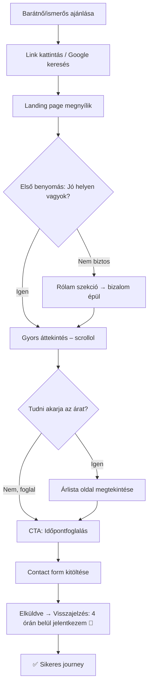
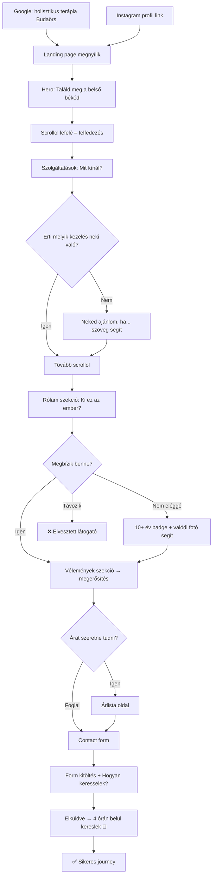
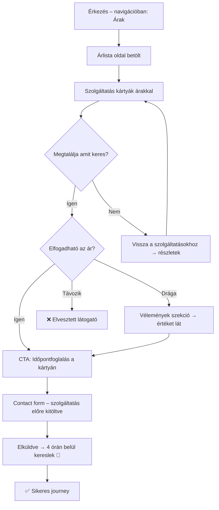

# UX Design Specification – Shanti

**Author:** Zsófi
**Date:** 2026-03-19

---

## Executive Summary

### Projekt víziója

A Shanti egy holisztikus terápiás praxis online jelenléte, amely meleg, nyugodt és spirituális hangulatot áraszt. Az oldal célja, hogy bizalmat építsen a látogatókban, bemutassa a szolgáltatásokat (Hawaii Lomi Lomi masszázs, Kineziológia, Energetikai kezelés, Holisztikus tanácsadás), és egyszerűvé tegye az időpontfoglalást. A vizuális világ a természet, napfény és belső béke érzését közvetíti.

### Célközönség

- **Elsődleges**: Nők, 25–55 év, akik nyitottak a holisztikus gyógyításra és alternatív terápiákra
- **Földrajzi fókusz**: Budapest és agglomerációja, különösen **Biatorbágy, Budaörs, Herceghalom** környéke
- **Technikai jártasság**: Közepes – mobilról böngésznek, szolgáltatást keresnek
- **Motiváció**: Testi-lelki egyensúly, stresszoldás, önismeret, természetes gyógymódok iránti nyitottság
- **Eszközhasználat**: Elsősorban mobil, másodsorban desktop

### Fő UX kihívások

- **Bizalomépítés első pillantásra** – A vizuális megjelenésnek azonnal nyugalmat és professzionalizmust kell sugároznia
- **Mobile-first élmény** – A célközönség nagy része mobilról érkezik
- **Egyszerű időpontfoglalás** – A kapcsolatfelvételi flow legyen gyors és akadálymentes
- **Helyi relevancia** – Budapest nyugati agglomerációjának megszólítása (Biatorbágy, Budaörs, Herceghalom)

### Design lehetőségek

- **Képek ereje** – A természetes, meleg fotók (naplemente, tengerpart, meditáció) azonnali hangulatot teremtenek
- **Árlista átláthatósága** – Önálló árlista oldal mint versenyelőny a transzparencia által
- **Lokális SEO** – A helyi fókusz kiemelése a tartalomban és meta adatokban

---

## Színpaletta

| Szín | Hex | Használat |
|---|---|---|
| **Terrakotta** | `#C17B5E` | Elsődleges akció szín (CTA gombok, kiemelések) |
| Terrakotta világos | `#D4A088` | Hover állapotok, enyhe kiemelések |
| Terrakotta sötét | `#A8624A` | Aktív/pressed állapotok |
| **Zsálya zöld** | `#9CAF88` | Másodlagos szín (elválasztók, ikonok, badge-ek) |
| Zsálya világos | `#B5C4A5` | Háttér kiemelések |
| Zsálya sötét | `#7D9466` | Hover variáns |
| **Krém** | `#FFF9F0` | Fő háttér szín |
| **Bézs** | `#F5EDE3` | Szekció háttér váltakozás |
| Bézs világos | `#FAF7F2` | Könnyű háttér variáns |
| Bézs sötét | `#E8DDD0` | Input mezők háttere |
| **Sötét barna** | `#3D3229` | Fő szöveg szín, footer háttér |
| Világos barna | `#6B5E52` | Másodlagos szöveg |
| Fehér | `#FFFFFF` | Kártya hátterek |

---

## Tipográfia

| Elem | Font | Méret | Súly | Megjegyzés |
|---|---|---|---|---|
| H1 (hero) | Playfair Display | clamp(2.5rem, 5vw, 4rem) | 400 | Elegáns, lélegző |
| H2 (szekció címek) | Playfair Display | clamp(2rem, 4vw, 3rem) | 400 | |
| H3 (alcímek) | Playfair Display | 1.5rem | 400 | |
| Subtitle/label | Inter | 0.85rem | 600 | Uppercase, 3px letter-spacing |
| Body | Inter | 1rem (16px) | 400 | line-height: 1.7 |
| Button | Inter | 0.9rem | 600 | Uppercase, 1px letter-spacing |
| Small/caption | Inter | 0.85rem | 400 | |

---

## Képek használata

- **Hero szekció**: Naplemente/tengerparti kép háttérként vagy vizuális elemként
- **Rólam szekció**: Meditáló nő fotó – a jelenlegi SVG placeholder helyére
- **Képstílus**: Enyhe warm-tone overlay az egységes megjelenés érdekében
- **Formátum**: WebP elsődlegesen, fallback JPG
- **Lazy loading**: Minden kép a fold alatt

---

## Kapcsolatfelvételi form

- **Megoldás**: EmailJS integráció (szerver nélküli, kliens oldali email küldés)
- **Cél email**: delizsofia108@gmail.com
- **Mezők**: Név (kötelező), Email (kötelező, validált), Szolgáltatás (dropdown), Üzenet (kötelező)
- **Validáció**: Kötelező mezők jelölése, email formátum ellenőrzés, valós idejű hibaüzenetek
- **Visszajelzés**: Sikeres küldés → zsálya zöld üzenet, hiba → terrakotta üzenet
- **Spam védelem**: Honeypot mező (rejtett mező, amit bot tölt ki)

---

## Mobil-specifikus UX

| Szempont | Döntés |
|---|---|
| **Megközelítés** | Mobile-first design |
| **Breakpointok** | 480px (mobil), 768px (tablet), 1024px (desktop) |
| **Navigáció** | Hamburger menü → teljes képernyős overlay |
| **Hero** | Egy oszlopos layout, badge-ek kisebb méretben |
| **Kártyák** | Teljes szélességű, egymás alatt |
| **CTA gombok** | Teljes szélesség mobilon |
| **Sticky CTA** | „Időpontfoglalás" gomb alul rögzítve mobilon |
| **Képek** | Adaptív méret, lazy loading |
| **Touch targets** | Minimum 44×44px minden interaktív elem |
| **Form inputok** | Nagyobb méret, megfelelő input type (email, tel) |

---

## Árlista oldal

- **Route**: `/arlista` – önálló oldal, nem landing page szekció
- **Navigáció**: Új „Árak" menüpont a headerben
- **Layout**: Szolgáltatásonkénti kártyák árakkal, időtartammal és rövid leírással
- **Design**: Meglévő kártya stílus továbbvitele (20px border-radius, hover effekt)
- **CTA**: Minden szolgáltatáskártyánál „Időpontfoglalás" gomb
- **Reszponzív**: Mobilon teljes szélességű kártyák egymás alatt

---

## Core User Experience

### Meghatározó élmény

A Shanti oldal két egyenrangú fő felhasználói akciót szolgál:
1. **Online időpontfoglalás** – A látogató a lehető legkevesebb lépésben tudjon időpontot kérni
2. **Árlista megtekintése** – Átlátható, önálló szekció, nem a szolgáltatásleírásba ágyazva

Minden szekció (hero, szolgáltatások, rólam, vélemények) ezekre a pillanatokra épít – bizalmat épít, hogy a látogató végül foglaljon vagy tájékozódjon az árakról.

### Platform stratégia

- **Platform**: Reszponzív web (Angular), mobile-first megközelítés
- **Forgalmi források**: Google keresés, Instagram, szájhagyomány
- **SEO fókusz**: Lokális keresés (Biatorbágy, Budaörs, Herceghalom + holisztikus terápia kulcsszavak)
- **Instagram integráció**: Link az oldalra, konzisztens vizuális világ az Insta tartalmakkal
- **Offline**: Nem szükséges

### Erőfeszítés nélküli interakciók

- **Időpontfoglalás**: Maximum 3 lépés – szolgáltatás kiválasztása → kapcsolatfelvételi form kitöltése → küldés. Minden oldalról elérhető a sticky CTA-n keresztül.
- **Árlista**: Egy kattintás a navigációból, azonnal átlátható kártya-layout. Nem kell keresgélni.
- **Kapcsolatfelvétel választása**: A felhasználó eldöntheti, hogy emailben vagy telefonon szeretne választ kapni (form mező: „Hogyan keresselek?")
- **Mobil navigáció**: Az oldal bármely pontjáról 1 kattintásra van az időpontfoglalás

### Kritikus sikerpillanatok

| Pillanat | Leírás | Hogyan érjük el |
|---|---|---|
| **Első benyomás** | A látogató megérkezik → azonnal érzi a nyugalmat | Meleg fotók, természetes színek, lélegző layout |
| **Bizalomépítés** | „Ez a terapeuta hiteles és tapasztalt" | Valódi fotók, vendégvélemények, 10+ év tapasztalat badge |
| **Ár átláthatóság** | „Pontosan tudom, mire számíthatok" | Önálló árlista szekció, tiszta kártya design |
| **Foglalás könnyedsége** | „Ez gyors volt és egyszerű" | Rövid form, azonnali visszajelzés küldés után |

### Élmény-alapelvek

1. **Nyugalom első** – Minden vizuális és interakciós döntés a belső béke érzetét erősíti. Nincs zsúfoltság, nincs agresszív CTA.
2. **Átláthatóság** – Árak, szolgáltatások, elérhetőség – semmi rejtett. A bizalom az átláthatóságból ered.
3. **Minimális erőfeszítés** – Időpontfoglalás és árlista megtekintése egyaránt 1-3 lépésen belül elérhető bármely oldalról.
4. **Személyes kapcsolat** – Az oldal nem automatizált rendszert közvetít, hanem egy valódi ember személyes figyelmét. A válasz emailben vagy visszahívással érkezik – a látogató választ.

---

## Desired Emotional Response

### Elsődleges érzelmi célok

| Fázis | Érzés | Design megvalósítás |
|---|---|---|
| **Érkezés** | „Azonnal érzem, hogy jó helyen vagyok" | Meleg fotók, természetes színpaletta, lélegző layout |
| **Ismerkedés** | „Ezt az embert megbízhatónak érzem" | Valódi fotók, személyes hangvételű szövegek, vendégvélemények |
| **Döntés** | „Pontosan tudom, mit kapok és mennyiért" | Átlátható árlista, tiszta szolgáltatásleírás |
| **Cselekvés** | „Már várom a kezelést!" | Könnyű foglalás, azonnali visszajelzés, várakozást építő üzenet küldés után |

### Érzelmi utazás térkép

```
Kíváncsiság → Nyugalom → Bizalom → Várakozás → Öröm
   (érkezés)   (hero)    (rólam)   (foglalás)   (megerősítés)
```

**Érkezés**: A látogató keresgél Google-ön vagy Instáról jön → kíváncsi, de óvatos.
**Hero szekció**: A meleg vizuális világ azonnal átöleli → „Jó helyen vagyok."
**Tartalom böngészés**: Minden szekció mélyíti a bizalmat → „Ez nekem való."
**Foglalás/Árlista**: Természetes lezárás → „Már várom a kezelést!"
**Hiba esetén**: Telefonszám mindig kéznél van → „Nem gond, felhívom." Soha nincs zsákutca.

### Mikro-érzelmek

| Érzés | Prioritás | Kezelés |
|---|---|---|
| **Összetartozás** | ⭐ Kiemelt | Az oldal azt kommunikálja: „Egy közösség vagy, ahol törődnek veled." Nem klinikai, hanem személyes. |
| **Bizalom** | ⭐ Kiemelt | Átláthatóság mindenben – árak, folyamat, személy |
| **Nyugalom** | ⭐ Kiemelt | Vizuális és interakciós szinten is – semmi idegesítő, semmi sürgető |
| **Megkönnyebbülés** | Fontos | „Végre találtam valakit" – a rólam szekció és vélemények ezt erősítik |
| Frusztráció | ❌ Elkerülendő | Mindig van alternatív út (telefon, email). Soha nincs zsákutca. |
| Bizonytalanság | ❌ Elkerülendő | Egyértelmű árak, egyértelmű folyamat |

### Design implikációk

| Érzelmi cél | UX döntés |
|---|---|
| „Jó helyen vagyok" | Hero: teljes képernyős meleg fotó + nyugodt tipográfia, nincs pop-up, nincs agresszív CTA |
| „Megbízom benne" | Valódi fotók (nem stock), vendégvélemények, 10+ év tapasztalat badge |
| „Tudom, mire számíthatok" | Önálló árlista szekció, szolgáltatásonkénti részletek |
| „Már várom!" | Form küldés után: „Köszönöm! Hamarosan jelentkezem 💛" – személyes üzenet |
| „Soha nincs zsákutca" | Telefonszám és email MINDIG látható: footerben, contact szekcióban, sticky mobilon |
| Összetartozás érzése | Személyes hangvétel, „Vendégeim mondták" (nem „ügyfelek"), meleg képi világ |

### Érzelmi design alapelvek

1. **Ölelés, nem eladás** – Az oldal nem nyomulós. Meghív, befogad, nyugalmat ad.
2. **Mindig van menekülőút** – Telefonszám és email soha nincs messze. Hiba esetén a látogató azonnal talál alternatívát.
3. **Személyes, nem klinikai** – „Vendégek", nem „ügyfelek". „Kezelés", nem „szolgáltatás". Az oldal egy ember hangján szól.
4. **Összetartozás** – A látogató nem egy tranzakció. Egy közösség tagja, ahol jó lenni.

---

## UX Pattern Analysis & Inspiration

### Inspiráló oldalak elemzése

#### Nutrition Stripped (nutritionstripped.com)

**Ami jól működik:**
- **Személyes brand** – A teljes oldal McKel Hill személye köré épül, nem klinikai, hanem emberi
- **Érzés-központú hero** – „When Food Feels Calm, Life Opens Up" – nem szolgáltatás-alapú, hanem érzelmi
- **Meleg, természetes fotók** – Valódi képek, napsütéses hangulat
- **Szelíd CTA-k** – Nem nyomulós, hanem meghívó tónusú
- **Testimonialok** – Személyes idézetek, nem csillagos értékelések
- **Szekciók váltakozása** – Lélegző, nem zsúfolt layout

#### LOFF Wellness (loff-wellness.nl)

**Ami jól működik:**
- **Közvetlen „Reserveren" gombok** – Minden csomagnál azonnal foglalhat a vendég
- **Élmény-csomagok kiemelése** – Nem lista, hanem élmény (pl. „Moeder & dochter beauty uitje")
- **Valódi vendégértékelések** – 3890 értékelés, 5.0 átlag
- **Kontakt infó mindig elérhető** – Cím, telefon, nyitvatartás, route tervező
- **Blog szekció** – Tartalommal építi a bizalmat és SEO-t

### Átvehető UX minták

| Forrás | Minta | Alkalmazás a Shantiban |
|---|---|---|
| Nutrition Stripped | Érzés-központú hero szöveg | Már megvan: „Találd meg a belső békéd" |
| Nutrition Stripped | Személyes hangvétel | Az egész oldalon – „vendég", nem „ügyfél" |
| Nutrition Stripped | Szelíd CTA stílus | Nem nyomulós gombok, hanem meghívó |
| LOFF | Közvetlen foglalás gomb | Minden szolgáltatásnál és az árlista oldalon |
| LOFF | Kontakt infó kéznél | Footer, contact szekció, sticky mobil CTA |
| LOFF | Nyitvatartás jól látható | Contact szekcióba integrálva |

### Anti-minták – amit elkerülünk

| Anti-minta | Miért kerüljük |
|---|---|
| Klinikai/orvosi megjelenés | Steril, fehér-kék, orvosi hangulat – nem illik a Shanti melegségéhez |
| Popup-ok | Megtöri a nyugalmat, agresszív érzés |
| Túl sok CTA egy szekcióban | Zavart kelt, nem nyugalmat |
| Stock fotók | Bizalmatlanságot szül – valódi képek kellenek |
| Rejtett árak / „Kérjen árajánlatot" | Bizonytalanságot okoz – az átláthatóság a mi erősségünk |
| Auto-play videó/zene | Megijeszti a mobilos felhasználót |

### Design inspiráció stratégia

**Átvesszük:**
- Nutrition Stripped: személyes brand + érzés-központú kommunikáció
- LOFF: közvetlen foglalási lehetőség + átlátható szolgáltatás struktúra

**Adaptáljuk:**
- LOFF csomagos megjelenítését → Shanti árlista oldal kártyás layout-ja
- Nutrition Stripped szekció váltakozását → Shanti landing page ritmusa

**Elkerüljük:**
- Klinikai/orvosi design
- Popup-okat és agresszív konverziós elemeket
- Rejtett árakat

---

## Design System Foundation

### Design System választás

**Egyedi (Custom) Design System** – CSS Custom Properties + SCSS alapú komponens rendszer

### Választás indoklása

- A Shanti vizuális világa egyedi: meleg terrakotta, zsálya zöld, krém – egyetlen UI framework sem adja ezt alapból
- Az oldal landing page jellegű, ~8-10 komplex komponenssel – nem szükséges nehézsúlyú framework
- A meglévő kódbázis már jól strukturált CSS változókkal és SCSS-sel épül
- Angular standalone komponensek természetes izolációt adnak
- Teljes kontroll a hangulat és az érzés felett – nincs framework „íze"

### Implementációs megközelítés

**Design Tokens (CSS Custom Properties):**
- Színek: `--color-terracotta`, `--color-sage`, `--color-cream` stb. (már megvan)
- Tipográfia: `--font-heading`, `--font-body` (már megvan)
- Spacing: `--section-padding`, `--container-max` (már megvan)
- Új tokenek: `--radius-card: 20px`, `--radius-button: 50px`, `--shadow-card`, `--shadow-hover`

**Komponens könyvtár:**
- Gombok: `.btn-primary`, `.btn-outline` (már megvan)
- Kártyák: egységes kártya stílus (szolgáltatások, árlista, vélemények)
- Form elemek: input, textarea, select, label – egységes stílus
- Layout: `.container`, szekció padding rendszer

### Testreszabási stratégia

- Új oldalakhoz (árlista) a meglévő tokenek és komponensek újrafelhasználása
- Sötét/világos szekció háttér váltakozás rendszerezése
- Mobilra optimalizált breakpoint rendszer (480/768/1024px)
- Animációs utility osztályok (fade-in, slide-up) – később, ha szükséges

---

## Meghatározó felhasználói élmény (Defining Experience)

### A meghatározó élmény

**„Van egy csodás nő, akihez mindenképp el kell menned – annyira fantasztikus gyógyulási élményem volt, amit neked is meg kell tapasztalnod."**

Ez a szájhagyomány a Shanti oldal UX-ének alapja. Az oldal feladata: **megerősíteni azt a bizalmat, amit a személyes ajánlás már elindított** – és elvezetni a foglalásig.

A kettős cél (megismerés + foglalás) egyformán fontos:
- **Új látogató** (Google/Insta): Megismerés → bizalomépítés → foglalás
- **Ajánlott látogató** (szájhagyomány): Megerősítés → gyors foglalás

### Felhasználói mentális modell

**Az ajánlott látogató gondolatmenete:**
1. „A barátnőm mesélte, milyen fantasztikus volt" → Keresés Google-ön / link kapás
2. „Látom az oldalt → igen, ez az!" → A vizuális világ megerősíti az elvárást
3. „Megnézem az árakat → rendben, ez reális" → Árlista átlátható
4. „Foglalok" → 3 kattintás, kész

**Az új látogató gondolatmenete:**
1. „Holisztikus terápia Biatorbágy/Budaörs" → Google találat
2. „Érdekes, milyen nyugodt ez az oldal" → Hero szekció befogad
3. „Ki ez az ember? Megbízható?" → Rólam + vélemények szekció
4. „Mennyibe kerül? Mit kapok?" → Árlista oldal
5. „Ezt kipróbálom" → Foglalás

### Sikerkritériumok

| Kritérium | Mérce |
|---|---|
| **Első benyomás** | 3 másodpercen belül: „Jó helyen vagyok" érzés |
| **Bizalomépítés** | A rólam szekció + vélemények után: „Ő az, akit kerestem" |
| **Áttekinthetőség** | Az árlista oldalon 10 másodperc alatt megtalálja a releváns árat |
| **Foglalás** | Maximum 3 lépés: CTA kattintás → form kitöltés → küldés |
| **Megerősítés** | Küldés után: személyes üzenet → „Már várom!" érzés |
| **Nincs zsákutca** | Ha bármi nem működik → telefon/email 1 kattintásra |

### UX minták

**Bevált mintákat használunk** – ez nem újító app, hanem egy meleg, személyes landing page:

- Scroll-alapú storytelling (hero → szolgáltatások → rólam → vélemények → foglalás)
- Kártya-alapú információ megjelenítés (szolgáltatások, árlista)
- Egyszerű form-alapú időpontfoglalás (nem komplex booking rendszer)
- Sticky CTA mobilon (állandó hozzáférés a foglaláshoz)

**Egyedi csavar:** Az oldal nem klinikai infót közvetít, hanem **élményt ígér**. A szövegek, képek és hangulat mind azt mondják: „Ezt meg kell tapasztalnod."

### Élmény-mechanika

**1. Indítás (Trigger):**
- Szájhagyomány: „Nézd meg az oldalát!" → link kattintás
- Google: „holisztikus terápia Budaörs" → találat → kattintás
- Instagram: profil link → landing page

**2. Interakció (Felfedezés):**
- Hero: meleg kép + „Találd meg a belső békéd" → scroll ikon hív lefelé
- Természetes görgetés: szolgáltatások → rólam → vélemények → árak → foglalás
- Bármikor: navigáció vagy sticky CTA → közvetlen foglalás

**3. Visszajelzés:**
- Vizuális: meleg színek, nyugodt tipográfia, valódi fotók → „igen, ez jó"
- Tartalmi: vendégvélemények → „mások is így éreztek"
- Funkcionális: form validáció → „jól csinálom"

**4. Befejezés:**
- Form elküldve → „Köszönöm szépen! Hamarosan jelentkezem 💛" üzenet
- A látogató tudja: emailben vagy telefonon kap választ (amit ő kért)
- Érzés: „Már várom a kezelést!"

---

## Visual Design Foundation

### Színrendszer

**Véglegesített paletta szemantikus leképezéssel:**

| Szemantikus név | Szín | Hex |
|---|---|---|
| Primary | Terrakotta | #C17B5E |
| Primary Hover | Terrakotta világos | #D4A088 |
| Primary Active | Terrakotta sötét | #A8624A |
| Secondary | Zsálya zöld | #9CAF88 |
| Secondary Hover | Zsálya világos | #B5C4A5 |
| Background | Krém | #FFF9F0 |
| Background Alt | Bézs | #F5EDE3 |
| Surface | Fehér | #FFFFFF |
| Text Primary | Sötét barna | #3D3229 |
| Text Secondary | Világos barna | #6B5E52 |
| Success | Zsálya zöld | #9CAF88 |
| Error | Terrakotta sötét | #A8624A |

**Szekció háttér váltakozás:** Krém → Bézs → Krém → Bézs

### Gomb rendszer

**Primary gomb (világos háttéren):**
- Alapállapot: háttér terrakotta `#C17B5E`, szöveg sötét barna `#3D3229` (~8:1 kontraszt ✅)
- Hover: háttér terrakotta világos `#D4A088`, szöveg sötét barna
- Active: háttér terrakotta sötét `#A8624A`, szöveg sötét barna

**Primary gomb (sötét háttéren – footer):**
- Alapállapot: háttér terrakotta `#C17B5E`, szöveg fehér `#FFFFFF`
- Hover: háttér terrakotta világos `#D4A088`, szöveg fehér
- Active: háttér terrakotta sötét `#A8624A`, szöveg fehér

**Outline gomb:**
- Alapállapot: keret + szöveg terrakotta, háttér átlátszó
- Hover: háttér kitöltődik terrakottával, szöveg sötét barnára vált

### Tipográfia rendszer

- **Heading**: Playfair Display (400, 700) – elegáns serif
- **Body**: Inter (400, 600) – tiszta sans-serif
- **Font betöltés**: Google Fonts, `font-display: swap`
- **Font preload**: `<link rel="preload">` a Playfair Display-hez – layout shift megelőzése
- **Fallback**: Playfair → Georgia → serif | Inter → Segoe UI → sans-serif
- **Olvashatóság**: Body min. 16px, line-height 1.7

### Spacing & Layout alap

**Alap egység: 8px** – CSS Custom Properties tokenekként

| Token | Érték | Használat |
|---|---|---|
| `--space-xs` | 4px | Ikon és szöveg közötti rés |
| `--space-sm` | 8px | Elemek közötti minimális tér |
| `--space-md` | 16px | Kártya belső padding |
| `--space-lg` | 24px | Container padding |
| `--space-xl` | 40px | Szekció cím alatti tér |
| `--space-2xl` | 60px | Szekciók közötti padding (mobil) |
| `--space-3xl` | 100px | Szekciók közötti padding (desktop) |

**Reszponzív spacing**: Szekció padding tokenek breakpoint-onként változnak:
- Mobil: `--section-padding: 60px 0`
- Desktop (1024px+): `--section-padding: 100px 0`

**Layout**: CSS Grid, max-width 1200px, lélegző white space szekciók között.

### Border Radius tokenek

| Token | Érték | Használat |
|---|---|---|
| `--radius-card` | 20px | Kártya lekerekítés (szolgáltatás, árlista, vélemény) |
| `--radius-button` | 50px | Pill-shaped gombok |
| `--radius-input` | 12px | Form input mezők |

### Kép kezelési szabályok

| Szempont | Szabály |
|---|---|
| **Border radius** | `--radius-card` (20px) – képek is lekerekítettek, mint a kártyák |
| **Hero kép aspect ratio** | 16:9 |
| **Portrait kép (rólam)** | 3:4 |
| **Overlay** | Enyhe lineáris gradient a kép aljára, ha szöveg kerül rá (hero) |
| **Filter** | Nem szükséges – a fotók hangulata természetesen illik a palettához |
| **Formátum** | WebP elsődlegesen, fallback JPG |
| **Lazy loading** | Minden kép a fold alatt |

### Akadálymentesség

| Szempont | Szabály |
|---|---|
| **Kontraszt** | Min. 4.5:1 normál szöveg, 3:1 nagy szöveg (WCAG AA) |
| **CTA gomb (világos bg)** | Sötét barna (#3D3229) terrakottán (#C17B5E): ~8:1 ✅ |
| **CTA gomb (sötét bg)** | Fehér (#FFF) terrakottán (#C17B5E): ~3.8:1 – nagy szöveg ✅ |
| **Body szöveg** | Sötét barna (#3D3229) krémen (#FFF9F0): ~12:1 ✅ |
| **Touch target** | Min. 44×44px |
| **Focus** | Látható outline minden fókuszálható elemen |
| **Alt szöveg** | Dekoratív: `alt=""`, tartalmi: leíró szöveg |
| **Szemantikus HTML** | `<nav>`, `<main>`, `<section>`, `<footer>` |
| **Form label** | Explicit `<label>` minden inputhoz |
| **Nyelv** | `<html lang="hu">` – helyes screen reader kiejtés |
| **Skip link** | „Ugrás a tartalomra" rejtett link billentyűzetes navigációhoz |
| **Reduced motion** | `@media (prefers-reduced-motion)` – animációk kikapcsolása |

---

## Design Direction döntés

### Választott irány

**A jelenlegi design marad változatlan.** A meglévő kódbázisban lévő vizuális világ (két oszlopos hero, kártya-alapú szekciók, terrakotta–zsálya–krém paletta, Playfair Display + Inter) a végleges design irány.

### Fejlesztési fókusz

1. Valódi fotók beépítése (rólam szekció, hero háttér)
2. Árlista oldal létrehozása (új route: `/arlista`)
3. Contact form EmailJS integrációja (delizsofia108@gmail.com)
4. Mobil UX finomhangolás (sticky CTA, teljes képernyős menü)
5. Akadálymentességi javítások (lang, skip link, reduced motion)
6. Gomb szövegszín frissítése sötét barnára

---

## User Journey Flows

### 1. Journey: Ajánlott látogató – gyors foglalás

**Kiindulás:** Szájhagyomány – „A barátnőm mesélte, milyen fantasztikus volt"
**Cél:** Időpont foglalás gyorsan, mert a bizalom már megvan



**Kritikus pontok:**
- A hero szekciónak azonnal megerősítenie kell: „Igen, ez az a hely, amiről meséltek"
- A CTA gomb mindig elérhető (sticky mobilon)
- Az árlista 1 kattintásra a navigációból

**Potenciális buktatók és megoldások:**

| Buktató | Megoldás |
|---|---|
| Nem találja gyorsan a foglalás gombot | Sticky CTA mobilon, navigáció minden oldalon |
| Nem érti melyik kezelés neki való | „Neked ajánlom, ha..." szöveg minden szolgáltatásnál |
| Ár nem egyértelmű | Önálló árlista oldal, szolgáltatásonként rendezve |

---

### 2. Journey: Új látogató – felfedezés

**Kiindulás:** Google keresés („holisztikus terápia Budaörs") vagy Instagram
**Cél:** Megismerni a terapeutát → bizalmat építeni → foglalni



**Kritikus pontok:**
- A **bizalomépítés** a legfontosabb – ez a journey a Rólam szekción áll vagy bukik
- Ha nem érti melyik kezelés neki való → **el fog menni**
- Az ár hiánya bizonytalanságot szül → **el fog menni**

**Potenciális buktatók és megoldások:**

| Buktató | Megoldás |
|---|---|
| Nem érti milyen kezelés lesz | „Neked ajánlom, ha..." mondat minden szolgáltatásnál |
| Nincs meg a bizalom | Valódi fotók + vendégvélemények + tapasztalat badge |
| Nem találja az árat | Árlista menüpont a navigációban, jól látható |

---

### 3. Journey: Árlista kereső

**Kiindulás:** Konkrétan az árakra kíváncsi (összehasonlít, dönt)
**Cél:** Átlátható árak → döntés → foglalás



**Kritikus pont:** Az árlista kártyán a „Időpontfoglalás" gomb **előre kitölti** a szolgáltatás mezőt a contact formban.

---

### Journey minták (közös elemek)

**Navigációs minták:**
- Minden oldalról elérhető a foglalás (sticky CTA + navigáció)
- Árlista 1 kattintásra a navigációból
- Vissza a főoldalra = logo kattintás

**Visszajelzés minták:**
- Form küldés → „Köszönöm! 4 órán belül kereslek 💛" (személyes, meleg)
- Hiba esetén → „Valami nem sikerült. Hívj fel: [telefonszám]" (soha nincs zsákutca)
- Validáció → Valós idejű, szelíd hibaüzenetek (terrakotta szín)

**Bizalomépítő minták:**
- Vendégvélemények mindegyik journey-ben megjelennek
- „10+ év tapasztalat" badge a Rólam szekciónál
- Valódi fotók – nem stock
- „Neked ajánlom, ha..." szöveg minden szolgáltatásnál:
  - **Lomi Lomi**: „Neked ajánlom, ha feszültséget érzel a testedben és szeretnéd elengedni"
  - **Kineziológia**: „Neked ajánlom, ha szeretnéd megérteni a stressz mélyebb okait"
  - **Energetikai kezelés**: „Neked ajánlom, ha kimerültnek érzed magad és szeretnéd visszanyerni az energiádat"
  - **Holisztikus tanácsadás**: „Neked ajánlom, ha úgy érzed, elakadtál és új perspektívára van szükséged"

### Flow optimalizálási elvek

1. **3 lépéses foglalás**: CTA kattintás → form kitöltés → küldés
2. **Előre kitöltés**: Árlista oldalról jön → szolgáltatás mező automatikusan kitöltve
3. **Soha nincs zsákutca**: Telefonszám és email mindig látható
4. **4 órás válasz ígéret**: Reális, teljesíthető, bizalmat épít
5. **„Neked ajánlom, ha..."**: Minden szolgáltatásnál segíti a döntést

---

## 11. Komponens stratégia

### Meglévő komponensek auditja

| Komponens | Állapot | Megjegyzés |
|-----------|---------|------------|
| Header | ✅ Kész | Fixed nav, hamburger menü, scroll effekt |
| Hero | ✅ Kész | 2 oszlopos, lebegő badge-ek |
| Services | ✅ Kész | 2×2 kártya grid, SVG ikonok |
| About | ⚠️ Részleges | Szöveg kész, **fotó SVG placeholder** – cserélni kell |
| Testimonials | ✅ Kész | 3 kártya layout |
| Contact | ⚠️ Részleges | Form layout kész, **email küldés hiányzik** |
| Footer | ✅ Kész | 3 oszlopos, sötét háttér |

### Szükséges új/módosított komponensek

| Komponens | Prioritás | Típus | Leírás |
|-----------|-----------|-------|--------|
| Árlista oldal | 🔴 Magas | Új route + komponens | `/arlista` – külön oldal árakkal, szolgáltatás leírásokkal |
| Contact form fix | 🔴 Magas | Módosítás | EmailJS integráció → delizsofia108@gmail.com |
| About fotó | 🔴 Magas | Módosítás | SVG placeholder cseréje valódi fotóra |
| Szolgáltatás kártya | 🟡 Közepes | Módosítás | „Neked ajánlom, ha..." szöveg hozzáadása |
| Sticky CTA | 🟡 Közepes | Új | Mobilon ragadós „Kapcsolat" gomb |
| Success message | 🟡 Közepes | Új | Form beküldés utáni visszajelzés |
| Form error fallback | 🟢 Alacsony | Új | „Nem gond, felhívom" – telefonszám megjelenítés hiba esetén |

### Implementációs ütemterv

**1. fázis – Magas prioritás:**
- Árlista oldal létrehozása (`/arlista` route)
- EmailJS integráció a contact formba
- About szekció fotó csere

**2. fázis – Közepes prioritás:**
- „Neked ajánlom, ha..." szövegek hozzáadása minden szolgáltatás kártyához
- Sticky CTA gomb mobilon
- Sikeres form beküldés visszajelzés

**3. fázis – Alacsony prioritás:**
- Form hiba fallback (telefonszám megjelenítés)
- Animációk és mikrointerakciók finomítása

---

## 12. UX Konzisztencia minták

### Gomb hierarchia

| Szint | Stílus | Használat | Példa |
|-------|--------|-----------|-------|
| **Elsődleges (Primary)** | Terrakotta háttér, sötétbarna szöveg | Fő CTA-k | „Kapcsolatfelvétel", „Üzenet küldése" |
| **Másodlagos (Secondary)** | Átlátszó, terrakotta keret | Kiegészítő akciók | „Részletek", „Árlista megtekintése" |
| **Szöveges (Text/Link)** | Aláhúzás nélkül, terrakotta szín, hover: aláhúzás | Navigációs linkek | „Tudj meg többet", „Vissza a főoldalra" |
| **Sötét háttéren** | Terrakotta háttér, fehér szöveg | Footer CTA-k | „Írj nekem" |

**Hover viselkedés:** Minden gombon enyhe méretváltozás (`scale: 1.03`) + tranzíció `0.3s ease`

### Form minták és validáció

**Contact form:**
- Valós idejű validáció (blur-re aktiválódik, nem gépelés közben)
- Hibaüzenetek: terrakotta szín, ikon + rövid szöveg (pl. „Kérlek add meg az email címed")
- Sikeres küldés: zsálya zöld háttérű üzenet – „Köszönöm az üzeneted! 4 órán belül válaszolok."
- **Hiba fallback**: Ha az EmailJS nem működik → „Nem gond, hívj fel: [telefonszám]" + email link

**Mezők:**
- Cream háttér, 1px beige keret
- Fókuszban: terrakotta keret, enyhe árnyék
- Placeholder szöveg: halvány szürke, eltűnik fókuszra
- Label mindig látható (floating label nincs – egyszerűség)

### Navigáció minták

- **Desktop**: Fixed header, átlátszó → scroll után cream háttér + árnyék
- **Mobil**: Hamburger menü, teljes képernyős overlay cream háttérrel
- **Árlista oldal**: Vissza gomb + header normál navigáció
- **Smooth scroll**: Anchor linkek animált görgetéssel (`scroll-behavior: smooth`)
- **Aktív szekció**: Navigációban a jelenlegi szekció terrakotta aláhúzással jelölve

### Visszajelzés minták (Feedback)

| Típus | Szín | Ikon | Példa |
|-------|------|------|-------|
| **Siker** | Zsálya zöld (`#9CAF88`) | ✅ | „Üzeneted elküldve!" |
| **Hiba** | Terrakotta (`#C17B5E`) | ❗ | „Valami hiba történt" |
| **Info** | Beige (`#F5EDE3`) | ℹ️ | „4 órán belül válaszolok" |

**Megjelenés:** Toast-szerű üzenet a form felett (nem modal, nem blokkolja az oldalt). 5 mp után halványodik el, vagy kézzel bezárható.

### Mobil-specifikus minták

- **Sticky CTA**: Fix „Kapcsolat" gomb az oldal alján, scroll után jelenik meg
- **Telefonszám**: Kattintható `tel:` link mindenhol
- **Kártyák**: Egymás alá rendezve (1 oszlop)
- **Képek**: `object-fit: cover`, arányos méretezés
- **Touch target**: Minimum 44×44px minden interaktív elemen

### Betöltés és üres állapotok

- **Betöltés**: Egyszerű CSS spinner terrakotta színben (nincs skeleton – egyoldalas)
- **Képek lazy load**: `loading="lazy"` attribútum
- **Fallback kép**: Ha egy fotó nem tölt be → cream háttérű placeholder Shanti logóval
